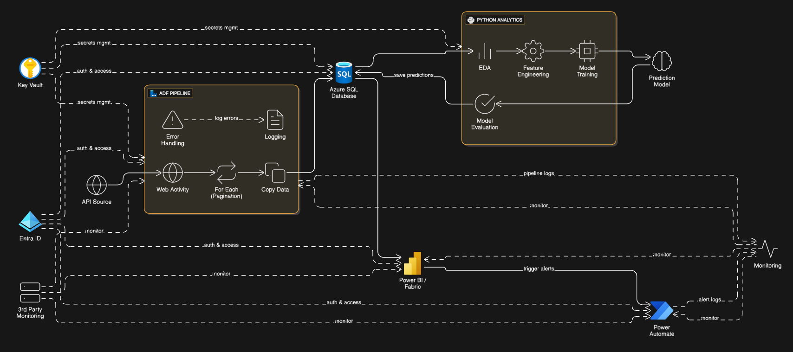

# 🚀 Azure Data Engineering & Sales Prediction System  

## 📘 Project Overview  
This repository contains a **production-grade data engineering and analytics pipeline** developed on **Microsoft Azure**.  
The system automates **data ingestion, transformation, machine learning forecasting, and Power BI reporting** for ERP-based sales data.

### 🎯 Business Objective  
- Automate extraction of ERP data such as sales, production, and stock.  
- Build an end-to-end **Sales Prediction System** for real-time forecasting.  
- Enable **Budget vs Actual vs Predicted** analysis in Power BI dashboards.  
- Integrate **Power Automate** for monitoring and automated email alerts.  

The project focuses on **automation, scalability, and actionable insights** for business planning and forecasting.

---

## 🏗️ Architecture Design  

### 🔹 Azure Components  
- **Azure Data Factory (ADF):** Orchestrates ETL workflows (API → SQL).  
- **Azure SQL Database:** Central data warehouse for actual and predicted data.  
- **Python Analytics (Jupyter/Databricks):** Data preparation, feature engineering, model training, and evaluation.  
- **Power BI / Fabric:** Visualizes performance metrics and forecasts.  
- **Power Automate:** Sends alerts and automates operational tasks.  
- **Azure Key Vault / Entra ID:** Handles authentication and secrets management.  
- **3rd Party Monitoring:** Tracks API and pipeline health.  

### 🔹 Data Flow Summary  
1. **API Data Ingestion:** ERP data fetched via ADF `Web Activity` and `ForEach` (pagination).  
2. **Data Loading:** Data stored in **Azure SQL Database** through `Copy Data` activity.  
3. **Data Analysis:** Python notebooks perform EDA, feature engineering, and ML modeling.  
4. **Prediction Storage:** Model outputs written back to Azure SQL.  
5. **Visualization:** Power BI dashboards provide Budget-Actual-Predicted comparisons.  
6. **Automation:** Power Automate manages email alerts and report refresh notifications.  



---

## ⚙️ Data Ingestion & Processing (ADF Pipeline)  

### 🧩 Activities Overview  
- **Web Activity:** Calls ERP APIs such as  
  ```
  https://api.erp.com/data?filter='fromdate'&'todate'
  ```
- **ForEach (Pagination):** Dynamically iterates across API pages.  
- **Copy Data Activity:** Writes JSON output into Azure SQL tables.  

### 🛡️ Error Handling & Logging  
- Built-in **Error Handling** captures failed responses and logs into SQL.  
- Dedicated **Logging Table** for audit and issue tracing.  
- Logs visualized in **Power BI** for monitoring and trend tracking.  

### 🔐 Authentication  
- **Azure Key Vault:** Stores API keys, SQL credentials, and tokens.  
- **Azure Entra ID:** Provides service principal authentication for secure access.  

---

## 🧱 Data Warehousing & Modeling  

### 📦 ERP Data Modules  
- Sales Invoice (Primary & Secondary)  
- Production Orders  
- Stock Data  
- Purchase Transactions  

Data is normalized and stored in structured **Base** and **Actual** tables for each ERP domain.  

### 🧩 Integration Logic  
Data is merged in SQL for:
- Item / Style / Region level aggregations  
- Month-over-month and year-over-year trends  
- Combined datasets for **Actual vs Predicted** analysis  

---

## 🧠 Exploratory Data Analysis (EDA) & Machine Learning  

### 🔍 EDA  
- Data pulled from SQL for initial exploration.  
- Missing values, outlier detection, and seasonal patterns analyzed.  

### ⚙️ Feature Engineering  
- Label encoding & scaling  
- Outlier removal (IQR / Z-score)  
- Lag & rolling features  
- Train-Test split by time period  

### 🤖 Modeling  
- **XGBoost** for short-term sales forecasting  
- **SARIMAX** for time-series forecasting (trend & seasonality)  

### 📈 Model Evaluation  
- Metrics: **RMSE**, **MAPE**, **R²**  
- Backtesting and cross-validation performed  
- Evaluation results logged back to SQL  

---

## 💾 Data Storage & Output Integration  

### 🧮 Prediction Output  
Predicted results written back to Azure SQL using:  
```python
df_predicted.write.mode("overwrite").saveAsTable("predicted_sales")
```

### 🧱 Schema Design  
| Table Name | Description |
|-------------|-------------|
| `actual_sales` | Stores live ERP data |
| `predicted_sales` | Stores ML model predictions |
| `sales_comparison` | Combines actual & predicted data for analytics |

Includes data versioning and refresh tracking columns (`run_id`, `created_at`, `model_version`).

---

## 📊 Visualization & Reporting (Power BI / Fabric)

### 🔸 Dashboard Highlights  
- **Budget vs Actual vs Predicted** sales views  
- Trendline & variance analysis by product, site, and region  
- KPI cards for forecast accuracy and growth  

### 🔒 Row-Level Security (RLS)  
- Filters data by user’s assigned region or department.  

### 🪄 Deployment & Refresh  
- Published to **Microsoft Fabric Workspace**.  
- Incremental refresh enabled via **Gateway** connection.  
- Access control managed via **Workspace Apps** for role-based sharing.  

---

## 📨 Automation, Monitoring & Alerts  

### 🔔 Power Automate Workflows  
- Automated emails for:
  - ADF pipeline failures  
  - Duplicate data detection  
  - Power BI refresh failures  
- Emails include formatted **HTML tables** summarizing job status.  

### 🩺 Monitoring  
- Power BI dashboards for operational KPIs (pipeline success rates, latency).  
- External API uptime monitored via **3rd Party Monitoring Tools**.  

---

## 🏁 Conclusion & Impact  

### ✅ Key Achievements  
- End-to-end **Azure-native pipeline** with full automation.  
- **Data-driven forecasting** improving sales visibility.  
- 80% reduction in manual reporting effort.  
- Near-real-time dashboards enhancing management decisions.  

### 🚀 Future Enhancements  
- Integration with **Azure Machine Learning (MLOps)** for model lifecycle management.  
- Implement **CI/CD pipelines** (GitHub Actions) for ADF, SQL, and Power BI.  
- Extend predictive models to **inventory and demand forecasting**.  

---

## 📂 Repository Structure  
```
├── data_pipeline/
│   ├── adf_pipeline.json
│   ├── api_activity_definition.json
│   └── logging_scripts/
│
├── sql_scripts/
│   ├── schema_definition.sql
│   ├── data_merge.sql
│   └── model_output.sql
│
├── python_model/
│   ├── eda.ipynb
│   ├── feature_engineering.py
│   ├── train_model.py
│   └── evaluate_model.py
│
├── powerbi_reports/
│   └── sales_forecast.pbix
│
├── automation/
│   ├── power_automate_flow.json
│   └── email_template.html
│
└── README.md
```

---

## 🧩 Tech Stack Summary  

| Layer | Technology |
|-------|-------------|
| Data Ingestion | Azure Data Factory (ADF) |
| Data Storage | Azure SQL Database |
| Analytics & ML | Python, PySpark, XGBoost, SARIMAX |
| Visualization | Power BI / Fabric |
| Automation | Power Automate |
| Security | Azure Key Vault, Entra ID |
| Monitoring | Power BI, 3rd-Party Monitoring |

---

## 📫 Contact  
For questions or collaboration:  
**👤 Developer:** Jasmeet  
**💼 Role:** Associate Data Analyst / Engineer — “Vibe Coder”  
